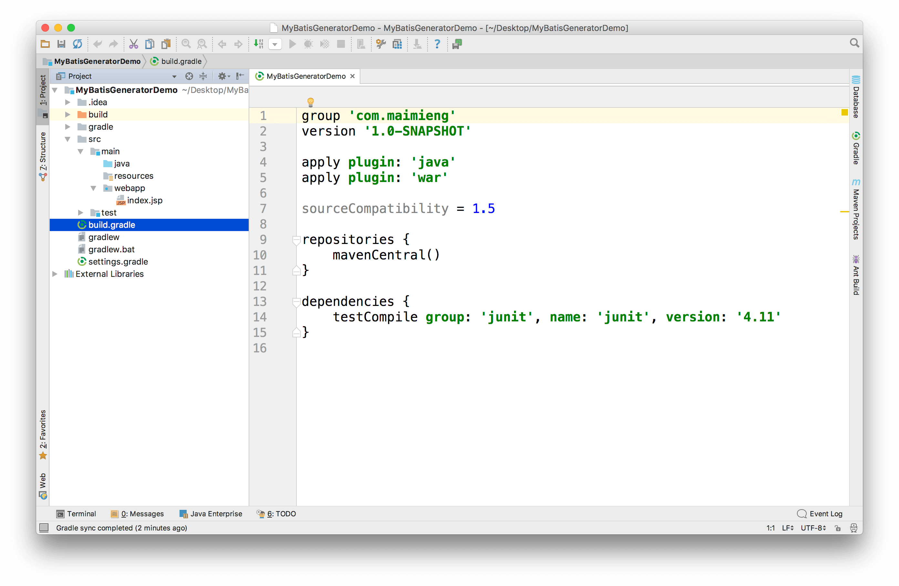
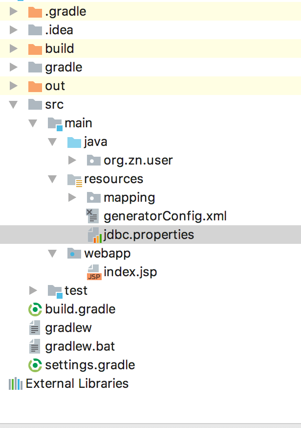
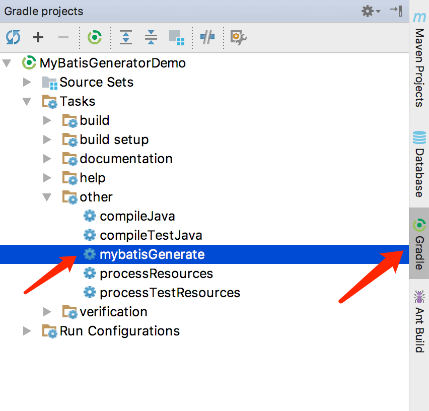
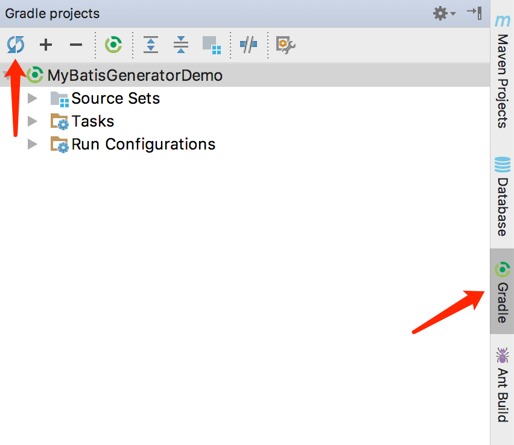
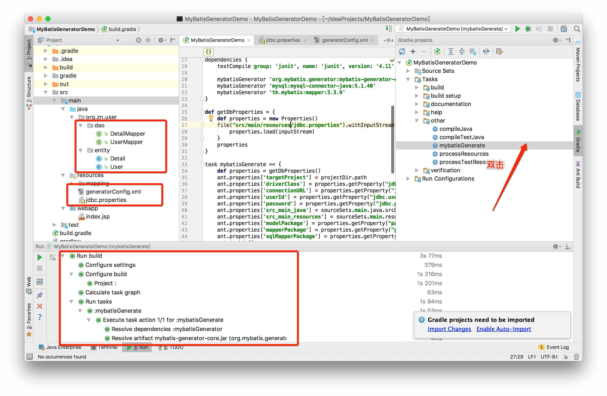

在 Intellij IDEA 中结合 Gradle 使用 MyBatis Generator 逆向生成代码

- JDK 1.8
- Gradle 3.5
- Intellij IDEA 2017

## 前言

Intellij IDEA 的教程较少，且 MyBatis Generator 不支持 Gradle 直接运行，因此这次是在自己折腾项目过程中，根据一些参考资料加上自己的实践得出的结论，并附上相应的 Demo 可供自己未来参考，也与大家分享。

本文的 Demo 也可以当作工具直接导入 IDEA，加上自己的数据库信息即可生成代码。

## 创建项目

创建步骤可以参考[intellij idea 2016 gradle搭建web工程](http://oxy.pub/2016/04/22/ssm1/)中。当创建完毕，需要等待 Gradle 联网构建，由于国内网络因素，可能需要稍作等待。当构建完成，目录结构应如下图一致：



## 配置依赖

这里需要使用 MyBatis Generator，MySQL 驱动，以及 MyBatis Mapper。由于代码生成单独运行即可，不需要参与到整个项目的编译，因此在 build.gradle 中添加配置：

```groovy
configurations {
mybatisGenerator
}
```

```groovy
dependencies {
testCompile group: 'junit', name: 'junit', version: '4.11'

mybatisGenerator 'org.mybatis.generator:mybatis-generator-core:1.3.5'
mybatisGenerator 'mysql:mysql-connector-java:5.1.40'
mybatisGenerator 'tk.mybatis:mapper:3.3.9'
}
```

## 设置数据库信息

在 resources 下，新建 mybatis 文件夹，并新建 jdbc.properties 和 generatorConfig.xml，文件结构如下：



在 config.properties 中配置数据库和要生成的 Java 类的包：

```properties
jdbc.driver=com.mysql.jdbc.Driver
jdbc.url=jdbc:mysql://192.168.1.11:3306/ssmDemo?characterEncoding=utf8
jdbc.username=root
jdbc.password=111111


# 生成实体类所在的包
package.model=org.zn.user.entity
# 生成 mapper 类所在的包
package.mapper=org.zn.user.dao
# 生成 mapper xml 文件所在的包，默认存储在 resources 目录下
package.xml=mapping
# 表名
package.tableName=user
# 生成实体类名称
package.entityName=User
```

## 设置生成代码的配置文件

在 generatorConfig.xml 中配置数据库表信息，可以参考官方的文档（附在文末）来进行配置：

```xml
<?xml version="1.0" encoding="UTF-8"?>
<!DOCTYPE generatorConfiguration
        PUBLIC "-//mybatis.org//DTD MyBatis Generator Configuration 1.0//EN"
        "http://mybatis.org/dtd/mybatis-generator-config_1_0.dtd">
<generatorConfiguration>
    <context id="Mysql" targetRuntime="MyBatis3Simple" defaultModelType="flat">
        <commentGenerator>
            <property name="suppressAllComments" value="true"></property>
            <property name="suppressDate" value="true"></property>
            <property name="javaFileEncoding" value="utf-8"/>
        </commentGenerator>

        <jdbcConnection driverClass="${driverClass}"
                        connectionURL="${connectionURL}"
                        userId="${userId}"
                        password="${password}">
        </jdbcConnection>

        <javaTypeResolver>
            <property name="forceBigDecimals" value="false"/>
        </javaTypeResolver>

        <javaModelGenerator targetPackage="${modelPackage}" targetProject="${src_main_java}">
            <property name="enableSubPackages" value="true"></property>
            <property name="trimStrings" value="true"></property>
        </javaModelGenerator>

        <sqlMapGenerator targetPackage="${sqlMapperPackage}" targetProject="${src_main_resources}">
            <property name="enableSubPackages" value="true"></property>
        </sqlMapGenerator>

        <!-- type="ANNOTATEDMAPPER",生成Java Model 和基于注解的Mapper对象
             type="MIXEDMAPPER",生成基于注解的JavaModel 和相应的Mapper对象
             type="XMLMAPPER",生成SQLMap XML文件和独立的Mapper接口  -->
        <javaClientGenerator targetPackage="${mapperPackage}" targetProject="${src_main_java}" type="XMLMAPPER">
            <property name="enableSubPackages" value="true"/>
        </javaClientGenerator>

        <!-- 这种方式是所有的表逆向生成类 下面是单个表具体看情况使用
        <table tableName="%">
            <generatedKey column="epa_id" sqlStatement="Mysql" identity="true" />
        </table> -->


        <!-- 要生成的表 tableName是数据库中的表名或视图名 domainObjectName是实体类名-->
        <table tableName="${tableName}" domainObjectName="${entityName}"
               enableCountByExample="false" enableUpdateByExample="false"
               enableDeleteByExample="false" enableSelectByExample="false"
               selectByExampleQueryId="false"></table>
    </context>
</generatorConfiguration>
```

## Gradle 设置 Ant Task

由于 MyBatis Generator 尚不支持 Gradle，所以只能使用 Gradle 来执行 Ant Task，达到相同的效果。

build.gradle:

```groovy
def getDbProperties = {
def properties = new Properties()
file("src/main/resources/jdbc.properties").withInputStream { inputStream ->
properties.load(inputStream)
}
properties
}

task mybatisGenerate << {
    def properties = getDbProperties()
    ant.properties['targetProject'] = projectDir.path
    ant.properties['driverClass'] = properties.getProperty("jdbc.driver")
    ant.properties['connectionURL'] = properties.getProperty("jdbc.url")
    ant.properties['userId'] = properties.getProperty("jdbc.username")
    ant.properties['password'] = properties.getProperty("jdbc.password")
    ant.properties['src_main_java'] = sourceSets.main.java.srcDirs[0].path
    ant.properties['src_main_resources'] = sourceSets.main.resources.srcDirs[0].path
    ant.properties['modelPackage'] = properties.getProperty("package.model")
    ant.properties['mapperPackage'] = properties.getProperty("package.mapper")
    ant.properties['sqlMapperPackage'] = properties.getProperty("package.xml")
    ant.properties['tableName'] = properties.getProperty("package.tableName")
    ant.properties['entityName'] = properties.getProperty("package.entityName")
    ant.taskdef(
            name: 'mbgenerator',
            classname: 'org.mybatis.generator.ant.GeneratorAntTask',
            classpath: configurations.mybatisGenerator.asPath
    )
    ant.mbgenerator(overwrite: true,
            configfile: 'src/main/resources/generatorConfig.xml', verbose: true) {
        propertyset {
            propertyref(name: 'targetProject')
            propertyref(name: 'userId')
            propertyref(name: 'driverClass')
            propertyref(name: 'connectionURL')
            propertyref(name: 'password')
            propertyref(name: 'src_main_java')
            propertyref(name: 'src_main_resources')
            propertyref(name: 'modelPackage')
            propertyref(name: 'mapperPackage')
            propertyref(name: 'sqlMapperPackage')
            propertyref(name: 'tableName')
            propertyref(name: 'entityName')
        }
    }
}
```

配置好 build.gradle，就可以在 IDEA 的 Gradle 菜单中找到新的 Task：



如果这里没有，可能是 Gradle 没有 build，重新刷新即可：



双击「mybatisGenerate」即可运行，如果配置正确即可运行成功：




## 总结

感谢网上博友的无私奉献，参考你们的博文最终得以完成

Gradle+SSM+MyBatis Generator源码地址：https://github.com/enamor/ssm

