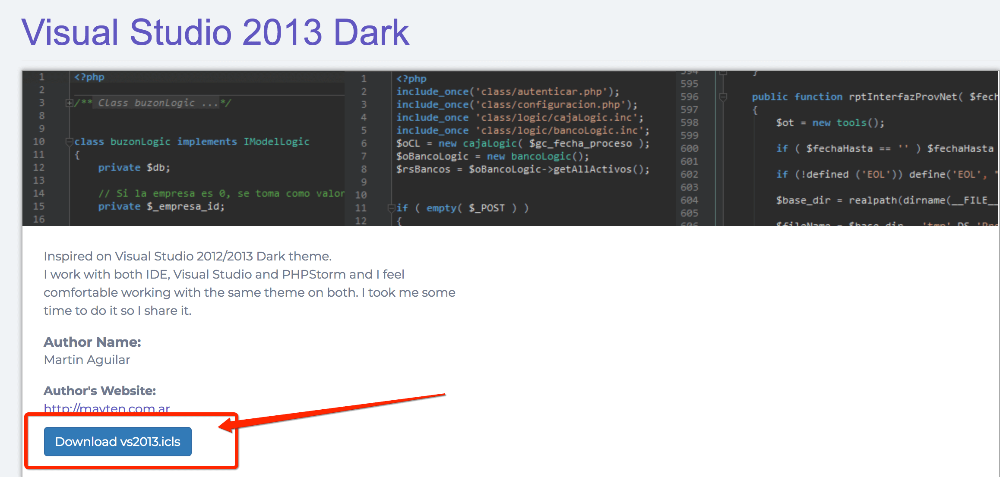
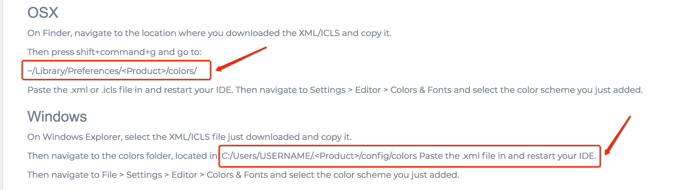
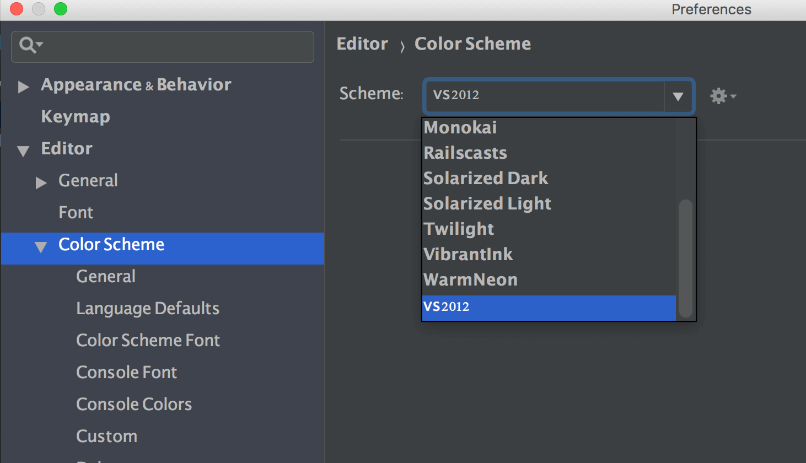
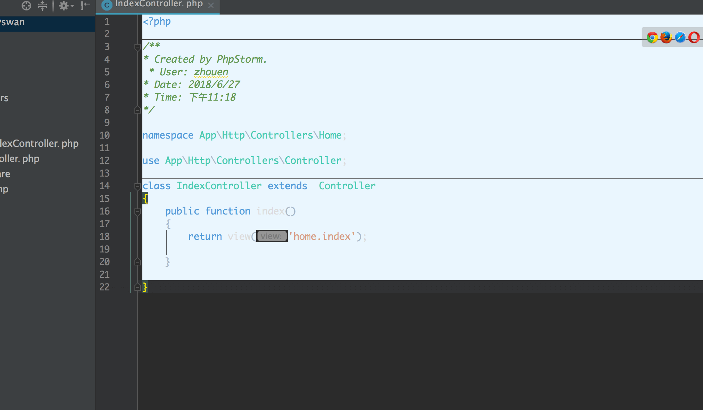
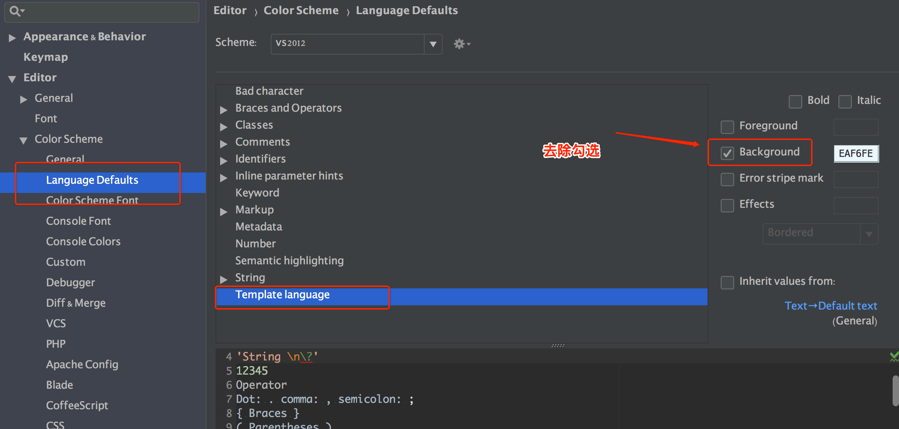
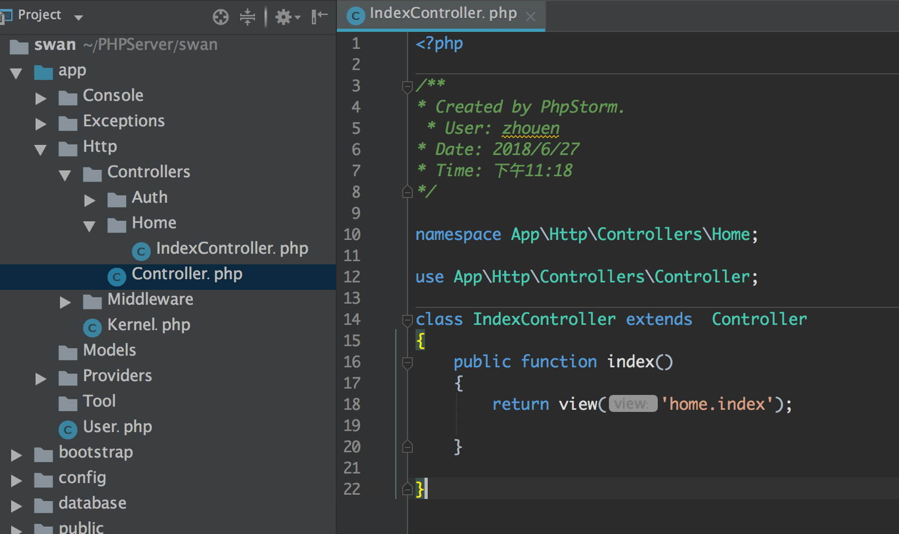

####概述

 PHPstorm默认的屎黄色的主题小编灰常不喜欢所以才有了以下替换自己喜欢主题的文章

以下为Mac系统操作如下

##### 第一步

去下载自己喜欢的主题：http://www.phpstorm-themes.com/  如下图：

谷歌浏览器默认会直接在浏览器打开不会去下载直接存储为xx.icls文件即可

##### 第二步

根据上面网站帮助介绍把下载的文件放入对应的路径中去

小编~/Library/Preferences/PhpStorm2018.1 目录下没有colors文件夹 手动创建后放入文件

##### 第三部

右上角PhpStorm -> preferences -> Color Scheme -> Scheme 下选择新添加的vs

操作如下：

设置apply OK 后会出现如下情况：

接着操作Color Scheme -> Language Defaults -> Template language  去除background的勾选

操作如下：

最终效果如下：

##### 最后

至于为啥不是操作Code Style (*PhpStorm -> preferences -> Code Style -> Scheme*) 的 Scheme 这个就不是小编的问题了

