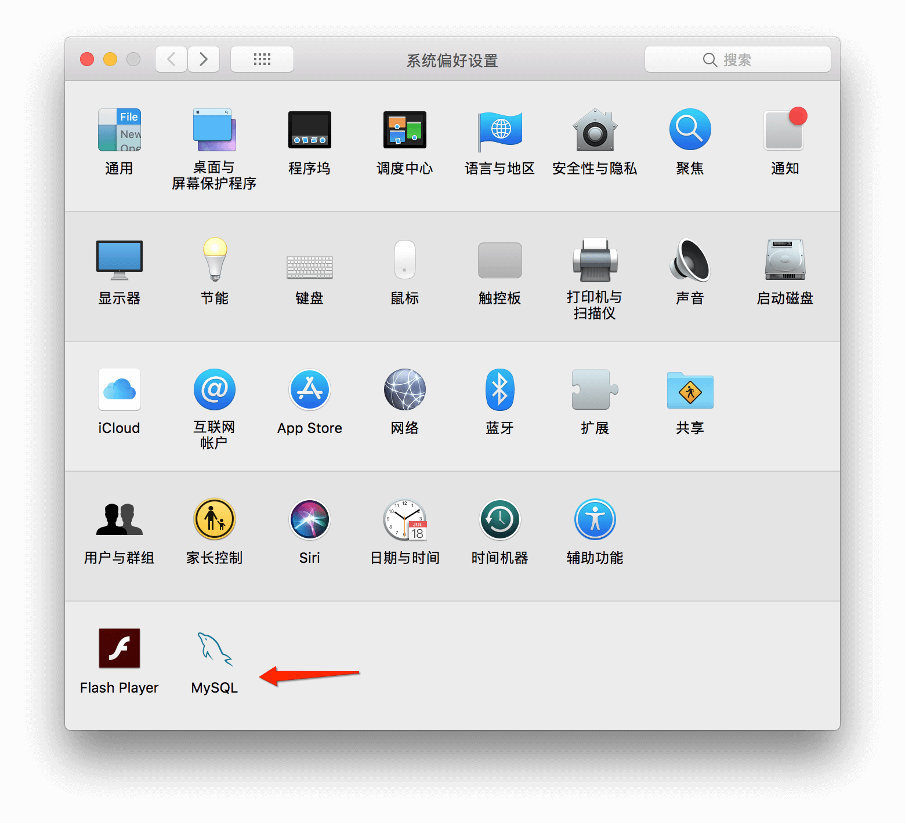

# 概述

Mac系统对于PHP运行非常友好,我们只需要进行简单的配置便可以开始进行使用,本篇文章将一步一步地介绍Apache、PHP和MySQL的安装与配置,为开始进行开发铺好路

# Apache

### 启动Apache服务

在Mac系统中已经安装好了Apache服务,我们只需要通过如下方式启动即可直接使用

##### 在终端中输入如下命令,启动Apache服务

```shell
sudo apachectl start
```

> 注: 因为sudo是系统管理指令,所以需要输入电脑密码(输入字符时不会显示,输入完成敲击回车即可)

##### 在终端中输入如下命令,查看Apache服务版本

```shell
sudo apachectl -v
```

在本机中版本信息如下

```shell
Server version: Apache/2.4.29 (Unix)
Server built:   Jan 17 2018 18:20:31
```

##### 在浏览器中输入如下网址,检查Apache服务是否启动成功

```http
http://localhost
http://127.0.0.1
```

如果Apache服务启动成功,页面会显示It works!

### Apache的其他配置

##### 关闭Apache服务

在终端中输入如下命令,关闭Apache服务

```shell
sudo apachectl stop
```

##### 重启Apache服务

在终端中输入如下命令,重启Apache服务

```shell
sudo apachectl restart
```

##### Apache服务安装路径

Apache服务默认安装路径在**/private/etc/apache2**,属于系统私有目录,我们不可直接在Finder中找到该路径


我们可以通过两种方式进入该路径

1. 在终端中输入open /etc命令进入etc文件夹
2. 在Finder -> 前往 -> 前往文件夹中输入/etc即可进入etc文件夹

##### Apache服务部署路径

Apache服务部署路径在**/资源库/WebServer/Documents/**,我们的项目需要放置在该路径下


如果想要修改部署路径,可以在**/private/etc/apache2**目录下找到并打开httpd.conf文件,搜索**DocumentRoot**并修改部署路径

> 注1: 笔者使用TextMate文本编辑软件,且该软件可以直接打开该配置文件
>
> 注2: 如果提示文本锁定不允许修改,可以将该文件复制到其他文件夹修改之后,在粘贴回来覆盖原文件即可


1. 将默认的项目路径由 /Library/WebServer/Documents/ 都替换成自己的路径，比如 /Users/zhouen/PHPServer   并将原路径下index.html.en 文件拷贝到新路径下

2. 修改路径重启apache后http://localhost，报403 Forbidden,You don't have permission to access/on this server ,解决方案：

   将AllowOverride None改为AllowOverride All

~~~shell
DocumentRoot "/Users/zhouen/PHPServer"
<Directory "/Users/zhouen/PHPServe">
    #
    # Possible values for the Options directive are "None", "All",
    # or any combination of:
    #   Indexes Includes FollowSymLinks SymLinksifOwnerMatch ExecCGI MultiViews
    #
    # Note that "MultiViews" must be named *explicitly* --- "Options All"
    # doesn't give it to you.
    #
    # The Options directive is both complicated and important.  Please see
    # http://httpd.apache.org/docs/2.4/mod/core.html#options
    # for more information.
    #
    Options FollowSymLinks Multiviews
    MultiviewsMatch Any

    #
    # AllowOverride controls what directives may be placed in .htaccess files.
    # It can be "All", "None", or any combination of the keywords:
    #   AllowOverride FileInfo AuthConfig Limit
    #
    #AllowOverride None
    AllowOverride All

    #
    # Controls who can get stuff from this server.
    #
    Require all granted
</Directory>
~~~


##### Apache服务端口号

Apache服务端口号默认为80,如果想要修改端口号,可以在**/private/etc/apache2**目录下找到并打开httpd.conf文件,搜索**Listen 80**并修改端口号


# PHP

PHP的启动只需要在Apache服务中进行一下配置即可直接使用

首先,在**/private/etc/apache2**目录下找到并打开httpd.conf文件

其次,搜索**#LoadModule php7_module libexec/apache2/libphp7.so**,将前方的**#**删除

/**如果因为权限问题不能修改的话，把它拖到桌面修改，然后把原先的删除，之后再把桌面的拖到里面去就ok***///

再次,重启Apache服务即可

最后,我们在路径下新建一个info.php测试程序试试效果吧

```php
<?php 
phpinfo(); 
?>
```

在浏览器中输入如下网址即可查看到PHP的信息

```http
http://localhost/info.php
```


# MySQL

### 安装MySQL

首先,在浏览器中输入如下网址,下载图中所示文件并安装

```http
http://dev.mysql.com/downloads/mysql/
```


安装完成,在终端中输入如下命令,查看MySQL版本

```shell
mysql --version
```

在本机中版本信息如下

```shell
mysql  Ver 8.0.11 for macos10.13 on x86_64 (MySQL Community Server - GPL)
```

如果提示**command not found**,这是因为该命令默认访问**/usr/local/bin/mysql**路径下的**mysql**,所以我们可以在终端输入如下命令,建立一个软链接即可

```shell
sudo ln -fs /usr/local/mysql/bin/mysql /usr/local/bin/mysql
```

再次,利用安装MySQL时给出的用户和密码登录MySQL服务,在终端中输入如下命令,敲击回车后输入密码

```shell
mysql -u root -p
```

再次,在终端中输入如下命令,退出MySQL服务

```shell
exit
```

如需修改密码,在终端中输入如下命令

```shell
/usr/local/mysql/bin/mysqladmin -u USER -p password PASSWORD
```

> 注: USER为用户名,默认为root;PASSWORD为新密码,回车后输入原密码即可

### MySQL的启动与停止

##### 在命令行输入如下指令,启动与停止MySQL服务

```
sudo /usr/local/mysql/support-files/mysql.server start
sudo /usr/local/mysql/support-files/mysql.server stop
```

##### 在系统偏好设置中启动与停止MySQL服务

在系统偏好设置中有一个MySQL选项,我们可以在这里手动启动与停止MySQL服务



### MySQL可视化管理方式phpMyAdmin

首先,在浏览器中输入如下网址,下载图中所示文件

```http
https://www.phpmyadmin.net/downloads/
```


其次,将压缩文件解压到**/资源库/WebServer/Documents/**路径下(如果修改过路径放入修改后的路径 中),并重命名为phpMyAdmin

再次,将文件夹中的**config.sample.inc.php**文件重命名为**config.inc.php**

再次,将**config.inc.php**文件中的如下代码进行修改

```
// 修改前:
$cfg['Servers'][$i]['host'] = 'localhost';

// 修改后:
$cfg['Servers'][$i]['host'] = '127.0.0.1';
```

最后,在浏览器中输入如下网址进行登录即可直接对MySQL进行可视化管理

```http
http://localhost/phpmyadmin/
```

> 注: 默认用户名为root

最终登录成功界面如下：

