---

title: intellij idea 2016 gradle搭建web工程

date: 2016-04-22

categories: "Java"

tags:

- SSM

description: intellij + Cradle 搭建 web工程

---

*前言：以前做java web 开发一直用eclipse 之后用了intellij idea之后就爱不释手。intellij idea搭建SSM框架过程中也颇费了一写功夫、现写篇文章来供大家参考。以求共同进步*
*操作系统：Mac OS*

**首先用gradle 创建java web 应用、之后再进行SSM的配置**

**1、如下图，第一步新建gradle工程，file->new->project **

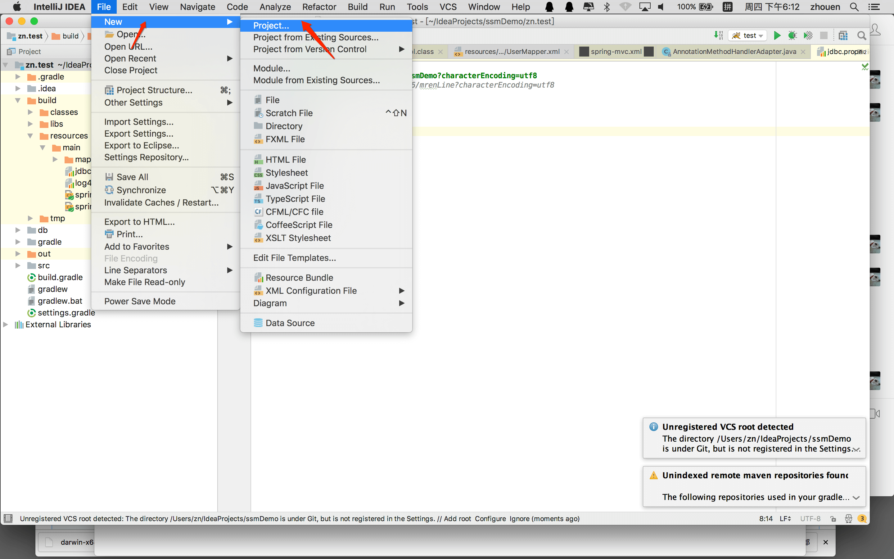

**2、勾选如图所示 点击next**

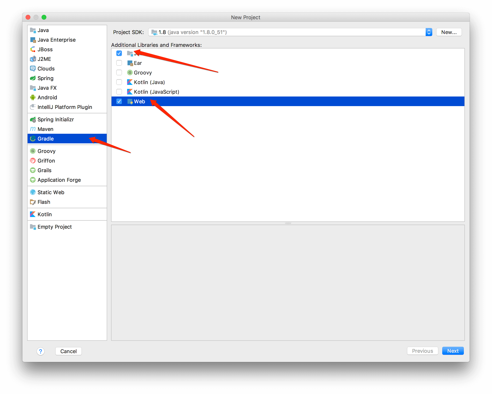

**3、如下图，到了输入groupId和acrtifactId窗口了，GroupID是项目组织唯一的标识符，实际对应JAVA的包的结构，是main目录里java的目录结构。 ArtifactID就是项目的唯一的标识符，实际对应项目的名称，就是项目根目录的名称。填写完成然后 next。 **

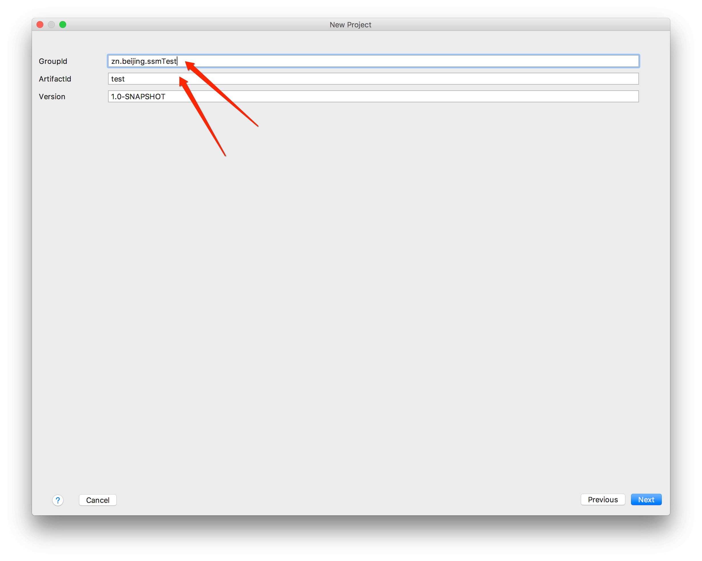

**4、如下图详细标注 **

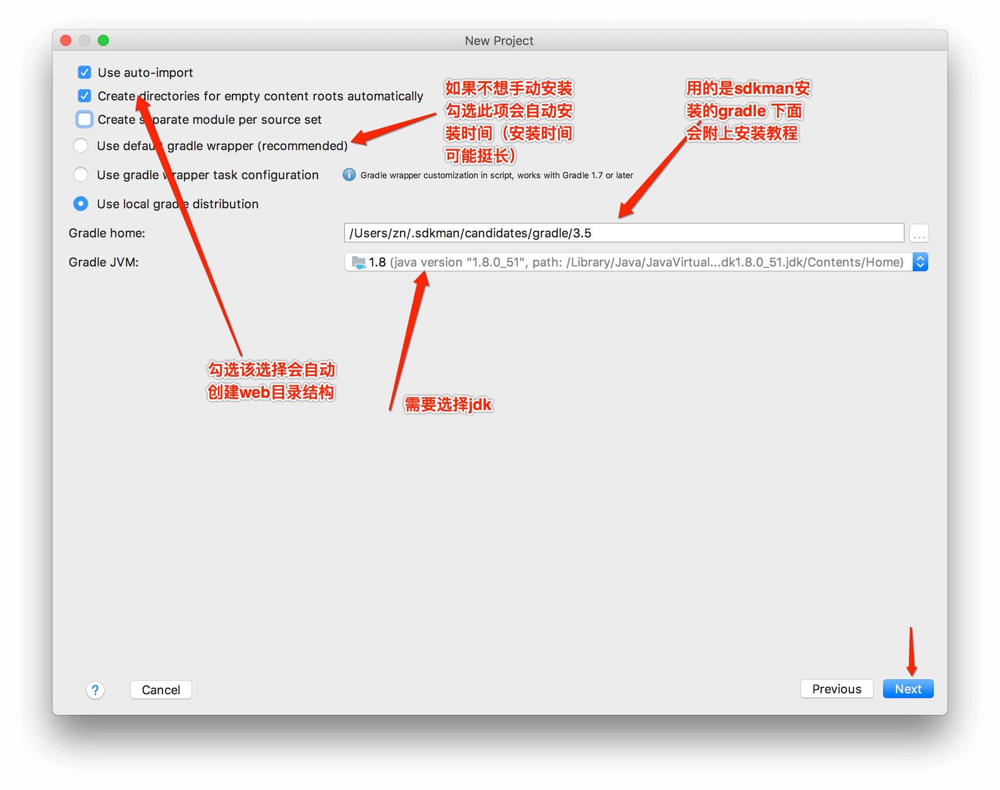

*Gradle手动安装方式 通过sdkman*

*1.sdkman安装<https:/sdkman.io/install.html>*

*2.安装gradle <https:/gradle.org/install>  只需执行 $ sdk install gradle 3.5*

**5、如下图 默认不用管直接finish**

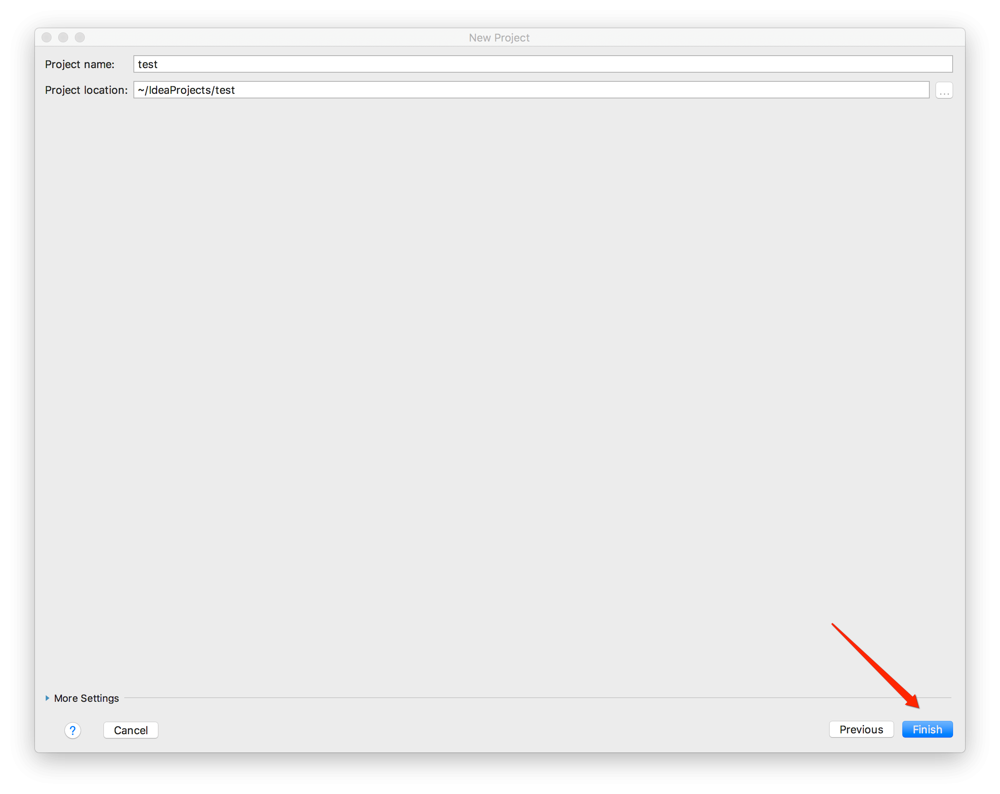

**6、web项目创建完成 目录结构如下才为正确创建**

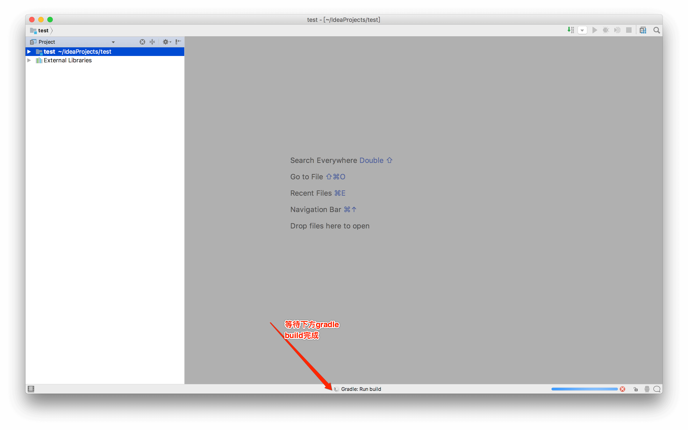

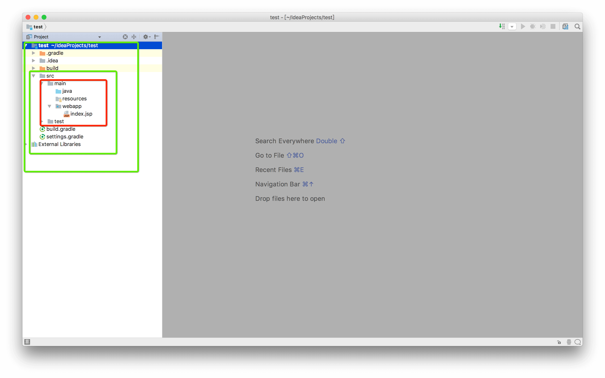

**7、如下系列图 部署到tomcat**

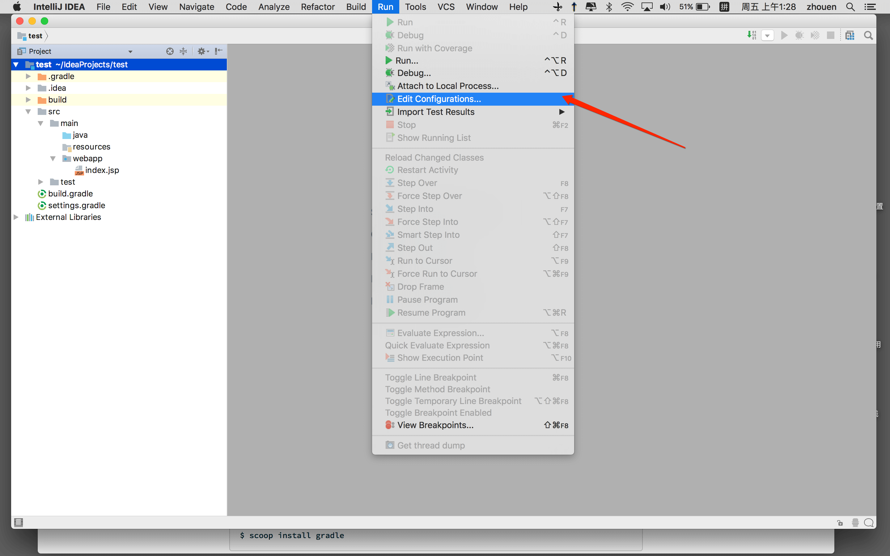

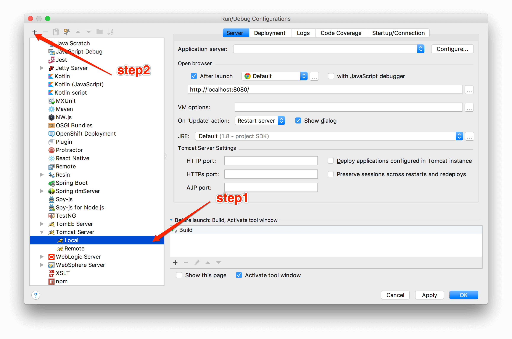

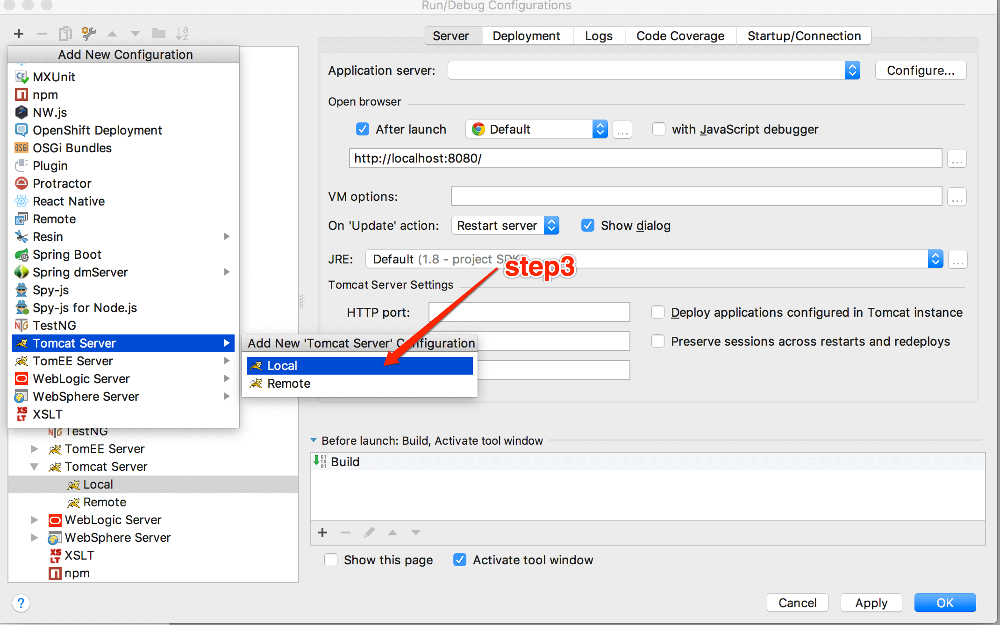

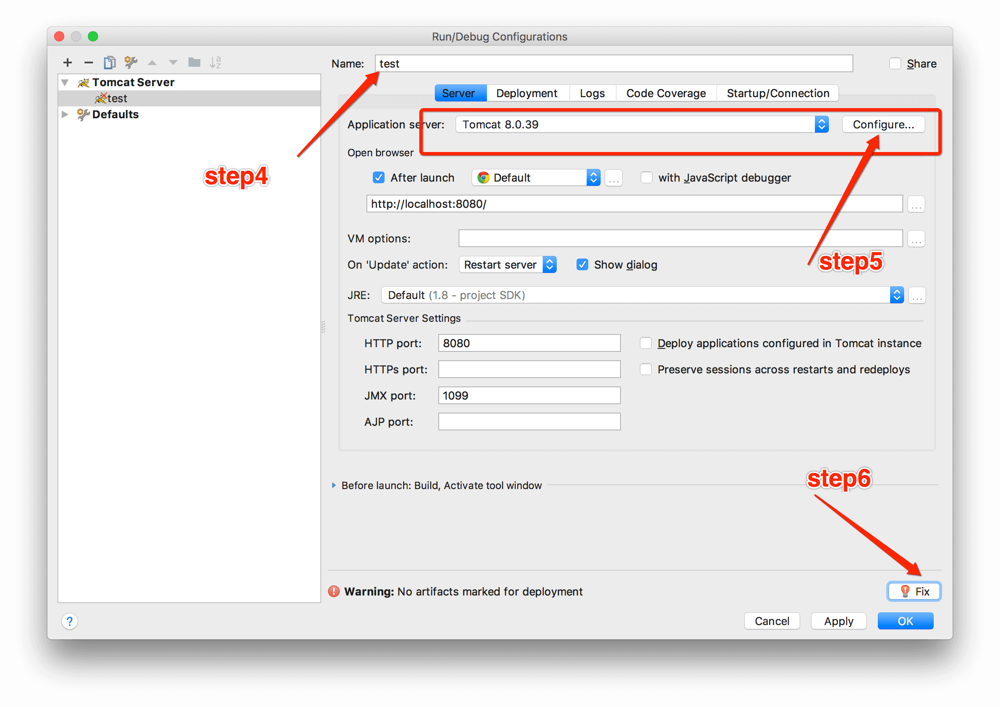

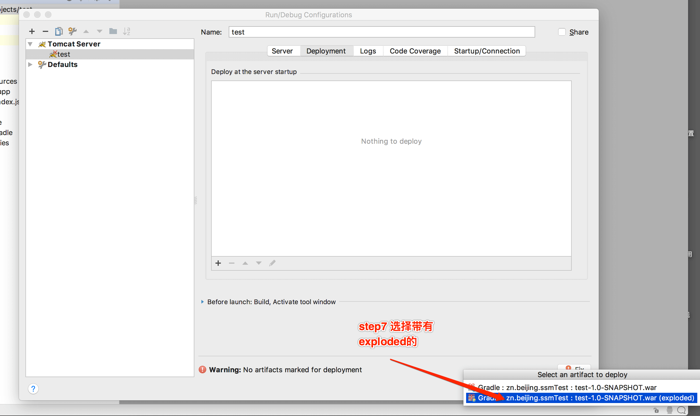

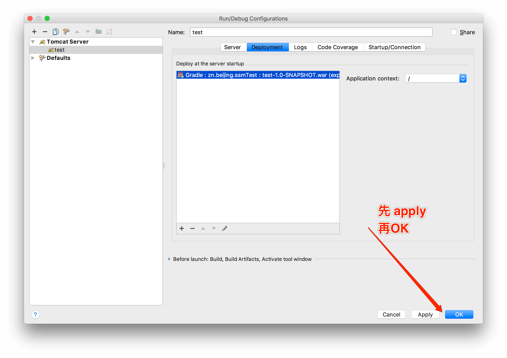

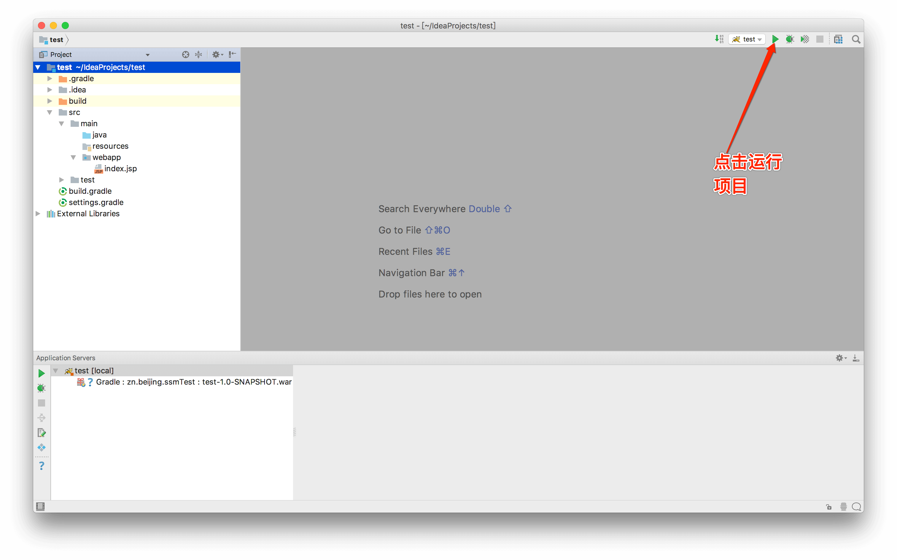

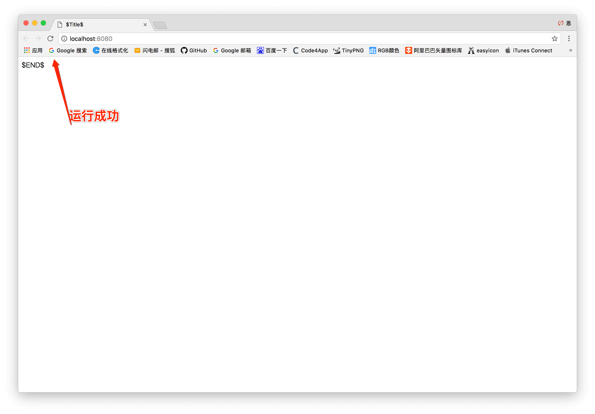

*至此第一步gradle的web项目创建完成*
