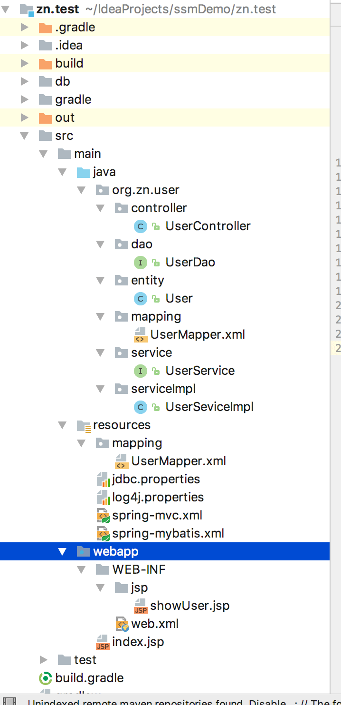
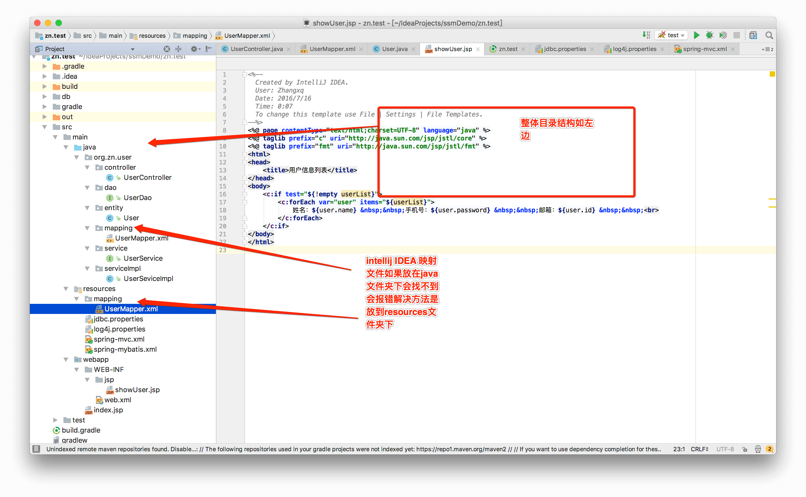

*操作系统：Mac OS*

**在上一篇文章intellij idea 2016 gradle搭建 web工程基础上进行如下操作**

**demo源码已经迁移至Github**    <https://github.com/enamor/ssm

**整体目录结构如下：**

**1、gradle进行项目jar包引入 bulid.gradle 文件dependencies 下加入**

~~~java
testCompile group: 'junit', name: 'junit', version: '4.11'

    def springVersion = "4.3.7.RELEASE"
    def mybatisVersion = "3.2.6"
    def log4jVersion = "1.2.17"

    // Spring依赖
    compile("org.springframework:spring-aop:$springVersion",
            "org.springframework:spring-orm:$springVersion",
            "org.springframework:spring-jdbc:$springVersion",
            "org.springframework:spring-instrument-tomcat:$springVersion",
            "org.springframework:spring-instrument:$springVersion",
            "org.springframework:spring-framework-bom:$springVersion",
            "org.springframework:spring-expression:$springVersion",
            "org.springframework:spring-core:$springVersion",
            "org.springframework:spring-context-support:$springVersion",
            "org.springframework:spring-context:$springVersion",
            "org.springframework:spring-beans:$springVersion",
            "org.springframework:spring-aspects:$springVersion",
            "org.springframework:spring-test:$springVersion",
            "org.springframework:spring-tx:$springVersion",
            "org.springframework:spring-web:$springVersion",
            "org.springframework:spring-webmvc:$springVersion",
            "org.springframework:spring-webmvc-portlet:$springVersion")

    //mybaits
    compile group: 'org.mybatis', name: 'mybatis', version: mybatisVersion
    //mybaits-spring
    compile group: 'org.mybatis', name: 'mybatis-spring', version: '1.2.2'

    //java ee jar 包
    compile group: 'javax', name: 'javaee-api', version: '7.0'

    //mysql
    compile group: 'mysql', name: 'mysql-connector-java', version: '5.1.6'
    compile group: 'commons-dbcp', name: 'commons-dbcp', version: '1.4'

    //阿里巴巴开源json处理
    //compile group: 'com.alibaba', name: 'fastjson', version: '1.2.7'

    //映入json
    compile group: 'com.fasterxml.jackson.core', name: 'jackson-core', version: '2.7.3'
    compile group: 'com.fasterxml.jackson.core', name: 'jackson-databind', version: '2.8.7'
    //compile group: 'org.codehaus.jackson', name: 'jackson-mapper-asl', version: '1.9.13'

    //jstl标签
    compile group: 'jstl', name: 'jstl', version: '1.2'

    //日志
    compile("log4j:log4j:$log4jVersion",
            "org.slf4j:slf4j-api:1.7.21",
            "org.slf4j:slf4j-log4j12:1.7.21")

    //上传组建包
    compile group: 'commons-fileupload', name: 'commons-fileupload', version: '1.3.1'
    compile group: 'commons-io', name: 'commons-io', version: '2.4'
    compile group: 'commons-codec', name: 'commons-codec', version: '1.10'

    compile group: 'junit', name: 'junit', version: '4.12'
~~~

**2、 建立jdbc.properties文件**

~~~pro
driver=com.mysql.jdbc.Driver
url=jdbc:mysql://192.168.1.6:3306/ssmDemo?characterEncoding=utf8
username=root
password=111111
#定义初始连接数
initialSize=0
#定义最大连接数
maxActive=20
#定义最大空闲
maxIdle=20
#定义最小空闲
minIdle=1
#定义最长等待时间
maxWait=60000
~~~

**3、建立log4j.properties文件**

~~~properties
#定义LOG输出级别
log4j.rootLogger=INFO,Console,File
#定义日志输出目的地为控制台
log4j.appender.Console=org.apache.log4j.ConsoleAppender
log4j.appender.Console.Target=System.out
#可以灵活地指定日志输出格式，下面一行是指定具体的格式
log4j.appender.Console.layout = org.apache.log4j.PatternLayout
log4j.appender.Console.layout.ConversionPattern=[%c] - %m%n

#文件大小到达指定尺寸的时候产生一个新的文件
log4j.appender.File = org.apache.log4j.RollingFileAppender
#指定输出目录
log4j.appender.File.File = logs/ssm.log
#定义文件最大大小
log4j.appender.File.MaxFileSize = 10MB
# 输出所以日志，如果换成DEBUG表示输出DEBUG以上级别日志
log4j.appender.File.Threshold = ALL
log4j.appender.File.layout = org.apache.log4j.PatternLayout
log4j.appender.File.layo
~~~

**4、建立spring-mvc.xml配置文件**

~~~xml
<?xml version="1.0" encoding="UTF-8"?>
<beans xmlns="http://www.springframework.org/schema/beans"
	xmlns:xsi="http://www.w3.org/2001/XMLSchema-instance" xmlns:p="http://www.springframework.org/schema/p"
	xmlns:context="http://www.springframework.org/schema/context"
	xmlns:mvc="http://www.springframework.org/schema/mvc"
	xsi:schemaLocation="http://www.springframework.org/schema/beans  
                        http://www.springframework.org/schema/beans/spring-beans-4.0.xsd  
                        http://www.springframework.org/schema/context  
                        http://www.springframework.org/schema/context/spring-context-4.0.xsd  
                        http://www.springframework.org/schema/mvc  
                        http://www.springframework.org/schema/mvc/spring-mvc-4.0.xsd">
	<!-- 自动扫描该包，使SpringMVC认为包下用了@controller注解的类是控制器 -->
	<context:component-scan base-package="org.zn" >    
   		 <context:exclude-filter type="annotation" expression="org.springframework.stereotype.Service" />    
	</context:component-scan>  
	
	<!--避免IE执行AJAX时，返回JSON出现下载文件 -->
	<bean id="mappingJacksonHttpMessageConverter"
		  class="org.springframework.http.converter.json.MappingJackson2HttpMessageConverter">
		<property name="supportedMediaTypes">
			<list>
				<value>text/html;charset=UTF-8</value>
			</list>
		</property>
	</bean>
	<!-- 启动SpringMVC的注解功能，完成请求和注解POJO的映射 -->
	<bean
		class="org.springframework.web.servlet.mvc.annotation.AnnotationMethodHandlerAdapter">
		<property name="messageConverters">
			<list>
				<ref bean="mappingJacksonHttpMessageConverter" />	<!-- JSON转换器 -->
			</list>
		</property>
	</bean>
	
	<!-- 定义跳转的文件的前后缀 ，视图模式配置-->
	<bean class="org.springframework.web.servlet.view.InternalResourceViewResolver">
		<!-- 这里的配置我的理解是自动给后面action的方法return的字符串加上前缀和后缀，变成一个 可用的url地址 -->
		<property name="prefix" value="/WEB-INF/jsp/" />
		<property name="suffix" value=".jsp" />
	</bean>
	
	<!-- 配置文件上传，如果没有使用文件上传可以不用配置，当然如果不配，那么配置文件中也不必引入上传组件包 -->
	<bean id="multipartResolver"  
        class="org.springframework.web.multipart.commons.CommonsMultipartResolver">  
        <!-- 默认编码 -->
        <property name="defaultEncoding" value="utf-8" />  
        <!-- 文件大小最大值 -->
        <property name="maxUploadSize" value="10485760000" />  
        <!-- 内存中的最大值 -->
        <property name="maxInMemorySize" value="40960" />  
    </bean> 
</beans>
~~~

**5、建立spring-mybatis.xml （spring和mybatis整合配置）**

~~~xml
	<?xml version="1.0" encoding="UTF-8"?>
<beans xmlns="http://www.springframework.org/schema/beans"
	xmlns:xsi="http://www.w3.org/2001/XMLSchema-instance" xmlns:p="http://www.springframework.org/schema/p"
	xmlns:context="http://www.springframework.org/schema/context"
    xmlns:aop="http://www.springframework.org/schema/aop"
    xmlns:tx="http://www.springframework.org/schema/tx"
	xmlns:mvc="http://www.springframework.org/schema/mvc"
	xsi:schemaLocation="http://www.springframework.org/schema/beans  
                        http://www.springframework.org/schema/beans/spring-beans-4.0.xsd  
                        http://www.springframework.org/schema/context  
                        http://www.springframework.org/schema/context/spring-context-4.0.xsd  
                        http://www.springframework.org/schema/aop
                        http://www.springframework.org/schema/aop/spring-aop-4.0.xsd
                        http://www.springframework.org/schema/tx
                        http://www.springframework.org/schema/tx/spring-tx-4.0.xsd
                        http://www.springframework.org/schema/mvc  
                        http://www.springframework.org/schema/mvc/spring-mvc-4.0.xsd">
	<!-- 自动扫描 -->
	<context:component-scan base-package="org.zn" >    
	    <context:exclude-filter type="annotation" expression="org.springframework.stereotype.Controller" />
	</context:component-scan>  
	
	<!-- 引入配置文件 -->
	<bean id="propertyConfigurer"
		class="org.springframework.beans.factory.config.PropertyPlaceholderConfigurer">
		<property name="location" value="classpath:jdbc.properties" />
	</bean>

	<bean id="dataSource" class="org.apache.commons.dbcp.BasicDataSource"
		destroy-method="close">
		<property name="driverClassName" value="${driver}" />
		<property name="url" value="${url}" />
		<property name="username" value="${username}" />
		<property name="password" value="${password}" />
		<!-- 初始化连接大小 -->
		<property name="initialSize" value="${initialSize}"></property>
		<!-- 连接池最大数量 -->
		<property name="maxActive" value="${maxActive}"></property>
		<!-- 连接池最大空闲 -->
		<property name="maxIdle" value="${maxIdle}"></property>
		<!-- 连接池最小空闲 -->
		<property name="minIdle" value="${minIdle}"></property>
		<!-- 获取连接最大等待时间 -->
		<property name="maxWait" value="${maxWait}"></property>
	</bean>

	<!-- spring和MyBatis完美整合，不需要mybatis的配置映射文件 -->
	<bean id="sqlSessionFactory" class="org.mybatis.spring.SqlSessionFactoryBean">
		<property name="dataSource" ref="dataSource" />
		<!-- 自动扫描mapping.xml文件 -->
		<property name="mapperLocations" value="classpath:mapping/*.xml"></property>
	</bean>
	

	<!-- DAO接口所在包名，Spring会自动查找其下的类 -->
	<bean class="org.mybatis.spring.mapper.MapperScannerConfigurer">
		<property name="basePackage" value="org.zn.**.dao" />
		<property name="sqlSessionFactoryBeanName" value="sqlSessionFactory"></property>
	</bean>
	
	<bean id="jdbcTemplate" class="org.springframework.jdbc.core.JdbcTemplate">
	<property name="dataSource" ref="dataSource" />
    </bean>

	<!-- (事务管理)transaction manager, use JtaTransactionManager for global tx -->
	<bean id="transactionManager"
		class="org.springframework.jdbc.datasource.DataSourceTransactionManager">
		<property name="dataSource" ref="dataSource" />
	</bean>
   <tx:annotation-driven transaction-manager="transactionManager"/>
</beans>
~~~

**6、web.xml配置文件**

~~~xml
<?xml version="1.0" encoding="UTF-8"?>  
<web-app xmlns:xsi="http://www.w3.org/2001/XMLSchema-instance"  
    xmlns="http://java.sun.com/xml/ns/javaee"  
    xsi:schemaLocation="http://java.sun.com/xml/ns/javaee http://java.sun.com/xml/ns/javaee/web-app_3_0.xsd"  
    version="3.0">  
    <display-name>Archetype Created Web Application</display-name>  
    <!-- Spring和mybatis的配置文件 -->  
    <context-param>  
        <param-name>contextConfigLocation</param-name>  
        <param-value>classpath:spring-mybatis.xml</param-value>  
    </context-param>

    <context-param>
        <param-name>log4jConfigLocation</param-name>
        <param-value>classpath:log4j.properties</param-value>
    </context-param>
    
    <!-- 编码过滤器 -->  
    <filter>  
        <filter-name>encodingFilter</filter-name>  
        <filter-class>org.springframework.web.filter.CharacterEncodingFilter</filter-class>  
        <async-supported>true</async-supported>  
        <init-param>  
            <param-name>encoding</param-name>  
            <param-value>UTF-8</param-value>  
        </init-param>  
    </filter>  
    <filter-mapping>  
        <filter-name>encodingFilter</filter-name>  
        <url-pattern>/*</url-pattern>  
    </filter-mapping>  
    <!-- Spring监听器 -->  
    <listener>  
        <listener-class>org.springframework.web.context.ContextLoaderListener</listener-class>  
    </listener>  
    <!-- 防止Spring内存溢出监听器 -->  
    <listener>  
        <listener-class>org.springframework.web.util.IntrospectorCleanupListener</listener-class>  
    </listener>  
  
    <!-- Spring MVC servlet -->  
    <servlet>  
        <servlet-name>SpringMVC</servlet-name>  
        <servlet-class>org.springframework.web.servlet.DispatcherServlet</servlet-class>  
        <init-param>  
            <param-name>contextConfigLocation</param-name>  
            <param-value>classpath:spring-mvc.xml</param-value>  
        </init-param>  
        <load-on-startup>1</load-on-startup>  
        <async-supported>true</async-supported>  
    </servlet>  
    <servlet-mapping>  
        <servlet-name>SpringMVC</servlet-name>  
        <!-- 此处可以可以配置成*.do，对应struts的后缀习惯 -->  
        <url-pattern>/</url-pattern>  
    </servlet-mapping>  
    <welcome-file-list>  
        <welcome-file>/index.jsp</welcome-file>  
    </welcome-file-list>  
  
</web-app>  
~~~

*以上配置文件已经配置完成*

___

*以下进行数据库创建及测试*

**1、表创建 及数据添加**

~~~mysql
/*
 Navicat Premium Data Transfer

 Source Server         : zhouen
 Source Server Type    : MySQL
 Source Server Version : 50630
 Source Host           : localhost
 Source Database       : ssmDemo

 Target Server Type    : MySQL
 Target Server Version : 50630
 File Encoding         : utf-8

 Date: 04/12/2016 10:56:27 AM
*/

SET NAMES utf8;
SET FOREIGN_KEY_CHECKS = 0;

-- ----------------------------
--  Table structure for `user`
-- ----------------------------
DROP TABLE IF EXISTS `user`;
CREATE TABLE `user` (
  `id` int(11) NOT NULL AUTO_INCREMENT COMMENT '用户id,自增长',
  `name` char(40) COLLATE utf8mb4_bin DEFAULT NULL COMMENT '用户名',
  `password` char(50) COLLATE utf8mb4_bin DEFAULT NULL COMMENT '密码',
  PRIMARY KEY (`id`)
) ENGINE=InnoDB AUTO_INCREMENT=8 DEFAULT CHARSET=utf8mb4 COLLATE=utf8mb4_bin COMMENT='用户表';

-- ----------------------------
--  Records of `user`
-- ----------------------------
BEGIN;
INSERT INTO `user` VALUES ('1', '张三', 'zhangsan'), ('2', '里斯', 'lisi'), ('3', '王五', 'wangwu'), ('6', '二麻子', '111111'), ('7', '霸道', '333333');
COMMIT;

SET FOREIGN_KEY_CHECKS = 1;

~~~

**2、类创建UserController**

~~~java
package org.zn.user.controller;

import org.springframework.stereotype.Controller;
import org.springframework.ui.Model;
import org.springframework.web.bind.annotation.RequestMapping;
import org.zn.user.entity.User;
import org.zn.user.service.UserService;

import javax.annotation.Resource;
import javax.servlet.http.HttpServletRequest;
import java.util.List;

/**
 * Created by zn on 2016/4/11.
 */
@Controller
@RequestMapping("/user")
public class UserController {
    @Resource
    private UserService userService;

    @RequestMapping("/showUser")
    public String showUser(HttpServletRequest request, Model model){

        List<User> userList = userService.selectAll();
        model.addAttribute("userList",userList);
        return "showUser";
    }
}
~~~

**3、UserMapper.xml创建** *数据库映射自动构建后期会写一篇文章专门讲解*

~~~xml
<?xml version="1.0" encoding="UTF-8"?>
<!DOCTYPE mapper PUBLIC "-//mybatis.org//DTD Mapper 3.0//EN" "http://mybatis.org/dtd/mybatis-3-mapper.dtd">
<mapper namespace="org.zn.user.dao.UserDao">
  <resultMap id="BaseResultMap" type="org.zn.user.entity.User">
    <id column="id" jdbcType="INTEGER" property="id" />
    <result column="name" jdbcType="CHAR" property="name" />
    <result column="password" jdbcType="CHAR" property="password" />
  </resultMap>

  <select id="selectAll" resultMap="BaseResultMap" >
    select *from user
  </select>
</mapper>
~~~

**4、实体类User的创建**

~~~java
package org.zn.user.entity;

import javax.persistence.GeneratedValue;
import javax.persistence.GenerationType;
import javax.persistence.Id;
import javax.persistence.Table;

public class User {

    private Integer id;

    private String name;

    private String password;

    /**
     * @return id
     */
    public Integer getId() {
        return id;
    }

    /**
     * @param id
     */
    public void setId(Integer id) {
        this.id = id;
    }

    /**
     * @return name
     */
    public String getName() {
        return name;
    }

    /**
     * @param name
     */
    public void setName(String name) {
        this.name = name;
    }

    /**
     * @return password
     */
    public String getPassword() {
        return password;
    }

    /**
     * @param password
     */
    public void setPassword(String password) {
        this.password = password;
    }

    @Override
    public String toString() {
        return "User{" +
                "id=" + id +
                ", name='" + name + '\'' +
                ", password='" + password + '\'' +
                '}';
    }
}
~~~

**5、showUser.jsp创建**

~~~jsp
<%--
  Created by IntelliJ IDEA.
  User: Zhangxq
  Date: 2016/7/16
  Time: 0:07
  To change this template use File | Settings | File Templates.
--%>
<%@ page contentType="text/html;charset=UTF-8" language="java" %>
<%@ taglib prefix="c" uri="http://java.sun.com/jsp/jstl/core" %>
<%@ taglib prefix="fmt" uri="http://java.sun.com/jsp/jstl/fmt" %>
<html>
<head>
    <title>用户信息列表</title>
</head>
<body>
    <c:if test="${!empty userList}">
        <c:forEach var="user" items="${userList}">
            姓名：${user.name} &nbsp;&nbsp;手机号：${user.password} &nbsp;&nbsp;邮箱：${user.id} &nbsp;&nbsp; 
        </c:forEach>
    </c:if>
</body>
</html>

~~~

**6、service层 和 dao层 自行创建  可下载demo参考**

**demo源码已经迁移至Github**    <https://github.com/enamor/ssm>

___

**小注**

**IDEA的maven 、gradle项目中，默认源代码目录下的xml等资源文件并不会在编译的时候一块打包进classes文件夹，而是直接舍弃掉。**

**解决办法：将xml或properties等配置文件放到resource下，并修改获取配置文件的代码，比如注册mapper.xml的位置等**

*如下图：*

